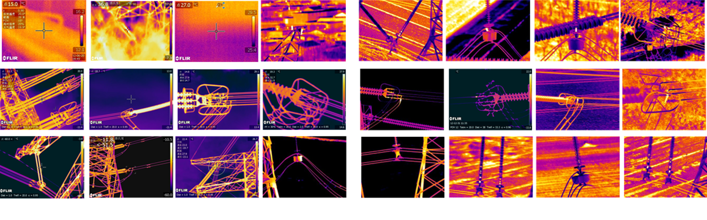
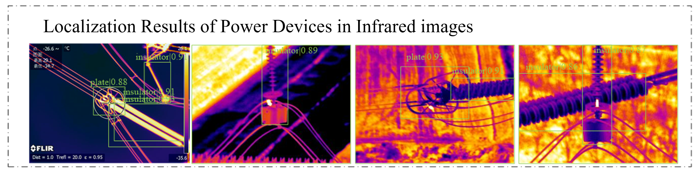
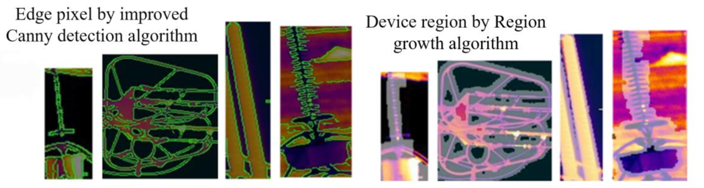

# Overheating Defect Identification in Power Transmission Lines based on Deep Learning
Overheating defects of high-voltage transmission line components are threatening security and stability of power systems. At present, infrared image is the main tool of detecting overheating defects in the field. Our project proposes a three-stage cascaded detection algorithm: cropping component image patch from whole image, segmenting component region in component image patch and locating overheating defect in component region, which removes the interference background step by step and finally realizes the heating diagnosis of insulator and drainage plate in the transmission line.

## Infrared images of transmission line

## Localization of Power Devices based on Faster R-CNN

- Building an infrared image dataset for power transmission lines based on the COCO Dataset structure.
- Training a Faster R-CNN object detection method to realize the localization of power devices.

  
## Segmentation of Device Regions based on improved Canny edge detection + Region growth algorithm

- The Canny edge detection algorithm can obtain the edge pixel matrix of component infrared images.
- The region growing algorithm filters the edge pixels of the background area by setting dual thresholds and uses morphological closing operations to generate the component area.
